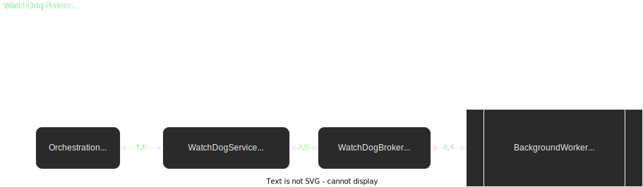

# TheStandard.PoC.TheWatchDog
PoC about integrating a BackgroundWorker as a Broker having in mind [The Standard](https://github.com/hassanhabib/The-Standard) by Hassan Habib.

Actual features
* Run a worker with some Action.
* Listen to inner events and notification progress event from the Action being runned.
* Control flow when worker ends.

Pending to be added
* Improved Tests.
* Add several IU technologies.
* Cancel the worker.
* Pausing / Resuming the worker.
* Throwing exceptions from worker.
* Returning results from worker.

