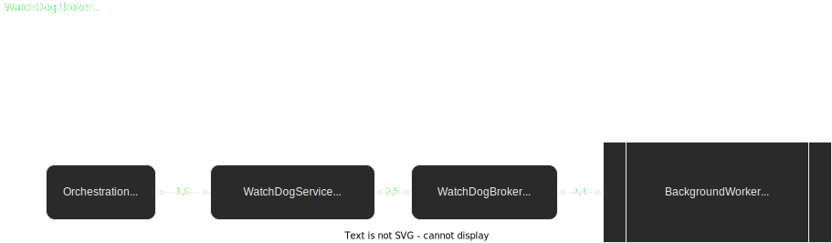

# TheStandard.PoC.TheWatchDog
PoC about integrating a BackgroundWorker as a Broker having in mind [The Standard](https://github.com/hassanhabib/The-Standard) by Hassan Habib.

###### DISCLAIMER. This is just a PoC, it´s a working progress to learn, think of the concepts and implementation details The Standard offers us.

[WatchDogBroker](TheWatchDog/Brokers/WatchDogBroker.cs) is a [Support Broker Type](https://github.com/hassanhabib/The-Standard/blob/master/1.%20Brokers/1.%20Brokers.md#141-support-brokers).

Actual features
* Runs a worker with some Action.
* Listens to inner events and notification progress event from the Action being runned.
* Let control flow when worker ends depending on its status.
* Includes a console application as an example to show how it´s used.

Pending to be added
* Improved Tests.
* Add several IU technologies.
* Cancel the worker.
* Pausing / Resuming the worker.
* Throwing exceptions from worker.
* Returning results from worker.
* Orchestration Service with a concrete use case.
* Add more than one background worker from a Service.
* ...

The [WatchDog](TheWatchDog/Models/WatchDog.cs) model acts as the local contract in order to abstract the external dependency/resource (BackgroundWorker).

The possibles [status and status changes](TheWatchDog/Models/WatchDogStatus.cs) WatchDog has

